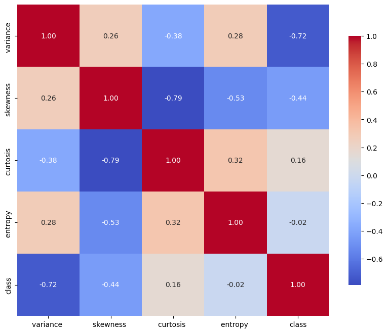
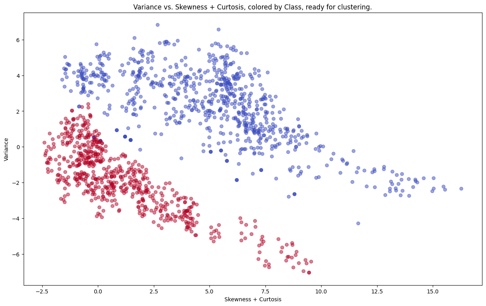
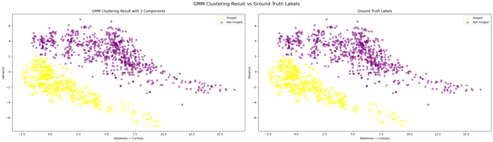

# 
subert_folder

Hello, welcome to the folder full of my attempts on clustering the datasets provided by this repository!

## 1. 🧠 [Banknote Authentication with Gaussian Mixture Models](https://github.com/Subtlr/Clustering-Datasets/blob/master/subert_folder/banknote_sW.ipynb)

This notebook explores unsupervised clustering techniques on the [Banknote Authentication dataset](https://archive.ics.uci.edu/ml/datasets/banknote+authentication).  
The goal was to distinguish between forged and genuine banknotes using statistical features without using the labels during training.

### 🚀 Project Highlights

- Engineered features like `skewness + kurtosis` and `variance` for better separability
- Benchmarked 2 clustering models, HDBSCAN and GMM
- Gaussian Mixture Models (GMM) achieved the best performance with an NMI of **0.8692**
- Visualized Gaussian ellipses to interpret cluster shapes and confidence (it's in the notebook)

### 🏆 GMM Clustering Results

  
  
  

Left to Right, Top to Bottom:
1. Correlation Matrix of the original features,
2. The dataset after feature engineering, lastly
3. The results of the GMM model versus the truth labels.

### 📁 Files

- `subert_folder/banknote_sW.ipynb`: Main notebook with all code, plots, and analysis
- `subert_folder/imgs/`: Folder containing the visualizations used above

### 📊 Metrics

| Model     | NMI Score |
|-----------|-----------|
| HDBSCAN   | 0.58      |
| **GMM**   | **0.869** |
> Built with curiosity, NumPy, and a little bit of chaos.  
> - Subert

## 2. 🧪 [Glass Dataset – Clustering & Compositional Interpretation](https://github.com/Subtlr/Clustering-Datasets/blob/master/subert_folder/glass_sW.ipynb)

This notebook dives into the [Glass Identification dataset](https://github.com/Subtlr/Clustering-Datasets/blob/master/01.%20UCI/glass.arff), where the challenge is to uncover structure based on **chemical features** alone, without using the glass type labels during clustering.

> Spoiler: the structure isn't clean. But the interpretation? That's where the magic happens.

### 🧠 Project Highlights

- Explored multiple models: GMM, Spectral Clustering, HDBSCAN
- Performed parameter sweeps for `n_clusters` and `n_neighbors` to optimize performance
- Used Silhouette, Davies-Bouldin, Calinski-Harabasz, and NMI to evaluate
- Built full-feature cluster profiles to interpret what *type of glass* each cluster might represent
- Created a final heatmap showcasing **standardized chemical fingerprints** per cluster

  

### 📊 Model Comparison Summary

| Model                                     | Silhouette Score ↑ | Davies-Bouldin Score ↓ | Calinski-Harabasz Score ↑ | NMI Score ↑ |
|------------------------------------------|---------------------|-------------------------|----------------------------|-------------|
| **HDBSCAN**                               | 0.1922              | 1.7807                  | 30.7995                    | 0.3758      |
| **GMM with 4 components**                 | 0.4611              | 1.5774                  | 100.4289                   | 0.3598      |
| **GMM with 5 components**                 | 0.4895              | 2.1281                  | 125.6370                   | 0.4237      |
| **Spectral Clustering (6 clusters, k=5)** | **0.5789**          | **0.7013**              | 91.6116                    | **0.4618**  |
| **MiniBatch KMeans (5 clusters)**         | 0.3857              | 1.1329                  | 101.3967                   | 0.3751      |

  

### 🔥 Final Heatmap Snapshot and Compelling Charts to Look At

  

  

### 🔬 Interpretation
- Cluster 0: Shares a similar Magnesium profile with Cluster 1, but stands out with its significantly lower Barium and moderate Iron levels. Suggests a less refractive, possibly industrial-grade composition.
- Cluster 1: Dominated by Barium, this cluster exhibits moderately high Magnesium and elevated Aluminum content. Its lower Refractive Index points to glass types with enhanced light dispersion, possibly specialized optics like headlamps.
- Cluster 2: Chemically unique, this cluster has the highest Potassium concentration and the lowest Silicon, hinting at a composition more aligned with decorative or specialty glass, where stability and optical purity are less emphasized.
- Cluster 3: A standout with the highest Refractive Index, Calcium, and Iron, while having the lowest Sodium. This cluster likely corresponds to denser, more robust glass types, such as vehicle windshields or high-strength glass.
- Cluster 4: Chemically clean and transparent, with the highest Silicon and Sodium concentrations and low Magnesium and Iron. This profile fits well with build-wind float glass, optimized for clarity and structural uniformity.

### 📁 Files

- `subert_folder/glass_sW.ipynb`: Full notebook, from preprocessing to interpretation
- `subert_folder/imgs/`: Plots for metrics, cluster mappings, and heatmap

### 📚 Bonus Takeaways

- Not all clusters align with human-centric labels (like “tableware” or “containers”)
- Unsupervised learning revealed overlapping chemical structures and fuzzy boundaries
- Interpretation > perfection: fingerprinting cluster compositions told the real story

> This honestly made me realize that the world is not all sunshine and rainbows...
> - Subert

## 3. 🍷 [Wine Dataset – Clustering & Chemical Composition Analysis](https://github.com/Subtlr/Clustering-Datasets/blob/master/subert_folder/wine_sW.ipynb)

This notebook explores the [Wine dataset](https://github.com/milaan9/Clustering-Datasets/blob/master/01.%20UCI/wine.arff), where the goal is to uncover natural groupings based on **chemical features** alone without relying on wine type labels during clustering.

> Spoiler: even if the clusters didn’t pour cleanly, the flavor profiles they revealed were anything but bland.

  

### 🧠 Project Highlights
- Explored clustering models: GMM, Spectral Clustering, and MiniBatch KMeans

  

- Used Silhouette, Davies-Bouldin, Calinski-Harabasz, and NMI for rigorous evaluation
- Generated heatmaps comparing GMM clusters to truth centroids using cosine similarity

  

- Interpreted standardized chemical compositions across clusters with visual fingerprinting

  

### 🔬 Cluster Interpretation from Feature Profiles

#### 🧪 Cluster 0 Interpretation
- **Truth Cluster Mean Highlights**:
  - 🟡 High in alcohol, magnesium, total phenols, flavanoids, proanthocyanins, and proline.
  - 🔵 Low in malic acid, alcalinity_of_ash, and nonflavanoid phenols.
- **GMM Cluster Mean Highlights**:
  - Matches truth fairly well in most features: alcohol slightly higher, magnesium a bit lower, total phenols and proanthocyanins even stronger.
  - Very close profile overall — phenolic fingerprint suggests robust wine types with bold flavors and good aging structure.

🔍 **Interpretation**: Likely represents classic, full-bodied red wines with strong antioxidant profiles and consistent chemical signatures.

---

#### 🍃 Cluster 1 Interpretation
- **Truth Cluster Mean Highlights**:
  - 🔵 Strongly low in alcohol, ash, magnesium, color intensity, proline.
  - 🟡 Modestly elevated alcalinity_of_ash and hue.
- **GMM Cluster Mean Highlights**:
  - Accurately captures low alcohol and ash.
  - Overestimates alcalinity_of_ash and underestimates hue.
  - Shows lower total phenols and proanthocyanins than truth.

🔍 **Interpretation**: Suggests wines with lighter body and reduced aromatic complexity — potentially more acidic or mineral-forward types. GMM exaggerates the alkalinity, which might skew predicted character toward sharper taste profiles.

---

#### 🍷 Cluster 2 Interpretation
- **Truth Cluster Mean Highlights**:
  - 🟡 Very high in malic acid, alcalinity_of_ash, nonflavanoid phenols, and color intensity.
  - 🔵 Strongly low in phenolics, hue, and od280/od315.
- **GMM Cluster Mean Highlights**:
  - Malic acid and color intensity are well aligned.
  - Alcalinity is underestimated; magnesium notably overestimated.
  - Phenolics somewhat misrepresented.

🔍 **Interpretation**: Likely indicative of highly acidic wines with mineral complexity and deeper color—but less aromatic depth. GMM partly misrepresents the phenolic profile, possibly confusing this with a richer style than truth supports.

### 📊 Clustering Performance Metrics on the Wine Dataset

| **Model**                     | **NMI ↑**   | **ARI ↑**   | **Homogeneity ↑** | **Completeness ↑** | **V-Measure ↑** | **Silhouette ↑** | **Davies-Bouldin ↓** | **Calinski-Harabasz ↑** |
|------------------------------|-------------|-------------|--------------------|---------------------|------------------|-------------------|------------------------|---------------------------|
| **Spectral Clustering**       | 0.0111      | 0.0004      | 0.0057             | 0.1796              | 0.0111           | 0.2803            | 0.4477                 | 3.3691                    |
| **Gaussian Mixture Model**    | **0.5823**  | **0.6075**  | **0.5849**         | **0.5798**          | **0.5823**       | 0.2833            | 0.8400                 | 181.2005                  |
| **HDBSCAN (min_cluster_size=5)** | 0.3942      | 0.2970      | 0.4051             | 0.3838              | 0.3942           | 0.4185            | 2.6880                 | 147.0661                  |
| **KMeans**                    | 0.4288      | 0.3711      | 0.4288             | 0.4287              | 0.4288           | **0.5711**        | 0.5342                 | **561.8157**              |
| **OPTICS**                    | 0.2847      | 0.0894      | 0.4305             | 0.2126              | 0.2847           | 0.0877            | **3.7888**             | 45.1746                   |
| **Affinity Propagation**      | 0.3497      | 0.1905      | 0.4957             | 0.2701              | 0.3497           | 0.5352            | 0.4994                 | **1282.2753**             |

> Models were evaluated on clustering alignment (NMI, ARI, V-Measure), geometric cohesion (Silhouette, DB score), and compactness (Calinski-Harabasz).  
> GMM emerged as the most balanced performer across label-alignment and structural integrity metrics.

### 📁 Files

- `subert_folder/wine_sW.ipynb`: Full notebook including preprocessing, clustering, evaluation, and interpretation
- `subert_folder/imgs/`: Contains visualizations like heatmaps and metrics across cluster models

### 🍇 Bonus Takeaways
- Chemical clustering doesn’t always follow traditional wine categories,but flavor patterns emerge nonetheless
- GMM and Spectral Clustering revealed nuanced distinctions in phenolic content, acidity, and alcohol levels
- Clustering taught me that wine isn't just fermented grapes, it's chemistry, personality, and mystery in a bottle

> Some clusters spark joy. Others… taste like regret.  
> – Subert

