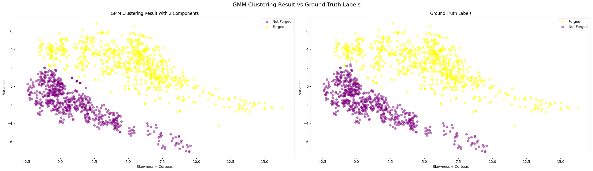

# 
subert_folder

Hello, welcome to the folder full of my attempts on clustering the datasets provided by this repository!

## 1. 🧠 [Banknote Authentication with Gaussian Mixture Models](https://github.com/Subtlr/Clustering-Datasets/blob/master/subert_folder/banknote_sW.ipynb)

This notebook explores unsupervised clustering techniques on the [Banknote Authentication dataset](https://archive.ics.uci.edu/ml/datasets/banknote+authentication).  
The goal was to distinguish between forged and genuine banknotes using statistical features without using the labels during training.

### 🚀 Project Highlights

- Engineered features like `skewness + kurtosis` and `variance` for better separability
- Benchmarked 2 clustering models, HDBSCAN and GMM
- Gaussian Mixture Models (GMM) achieved the best performance with an NMI of **0.8692**
- Visualized Gaussian ellipses to interpret cluster shapes and confidence (it's in the notebook)

### 🏆 GMM Clustering Results

  
  
  

Left to Right, Top to Bottom:
1. Correlation Matrix of the original features,
2. The dataset after feature engineering, lastly
3. The results of the GMM model versus the truth labels.

### 📁 Files

- `subert_folder/banknote_sW.ipynb`: Main notebook with all code, plots, and analysis
- `subert_folder/imgs/`: Folder containing the visualizations used above

### 📊 Metrics

| Model     | NMI Score |
|-----------|-----------|
| HDBSCAN   | 0.58      |
| **GMM**   | **0.869** |
> Built with curiosity, NumPy, and a little bit of chaos.  
> - Subert

## 2. 🧪 [Glass Dataset – Clustering & Compositional Interpretation](https://github.com/Subtlr/Clustering-Datasets/blob/master/subert_folder/glass_sW.ipynb)

This notebook dives into the [Glass Identification dataset](https://github.com/Subtlr/Clustering-Datasets/blob/master/01.%20UCI/glass.arff), where the challenge is to uncover structure based on **chemical features** alone, without using the glass type labels during clustering.

> Spoiler: the structure isn't clean. But the interpretation? That's where the magic happens.

### 🧠 Project Highlights

- Explored multiple models: GMM, Spectral Clustering, HDBSCAN
- Performed parameter sweeps for `n_clusters` and `n_neighbors` to optimize performance
- Used Silhouette, Davies-Bouldin, Calinski-Harabasz, and NMI to evaluate
- Built full-feature cluster profiles to interpret what *type of glass* each cluster might represent
- Created a final heatmap showcasing **standardized chemical fingerprints** per cluster

  

### 📊 Model Comparison Summary

| Model                                     | Silhouette Score ↑ | Davies-Bouldin Score ↓ | Calinski-Harabasz Score ↑ | NMI Score ↑ |
|------------------------------------------|---------------------|-------------------------|----------------------------|-------------|
| **HDBSCAN**                               | 0.1922              | 1.7807                  | 30.7995                    | 0.3758      |
| **GMM with 4 components**                 | 0.4611              | 1.5774                  | 100.4289                   | 0.3598      |
| **GMM with 5 components**                 | 0.4895              | 2.1281                  | 125.6370                   | 0.4237      |
| **Spectral Clustering (6 clusters, k=5)** | **0.5789**          | **0.7013**              | 91.6116                    | **0.4618**  |
| **MiniBatch KMeans (5 clusters)**         | 0.3857              | 1.1329                  | 101.3967                   | 0.3751      |

  

### 🔥 Final Heatmap Snapshot and Compelling Charts to Look At

  

  

### 🔬 Interpretation
- Cluster 0: Shares a similar Magnesium profile with Cluster 1, but stands out with its significantly lower Barium and moderate Iron levels. Suggests a less refractive, possibly industrial-grade composition.
- Cluster 1: Dominated by Barium, this cluster exhibits moderately high Magnesium and elevated Aluminum content. Its lower Refractive Index points to glass types with enhanced light dispersion, possibly specialized optics like headlamps.
- Cluster 2: Chemically unique, this cluster has the highest Potassium concentration and the lowest Silicon, hinting at a composition more aligned with decorative or specialty glass, where stability and optical purity are less emphasized.
- Cluster 3: A standout with the highest Refractive Index, Calcium, and Iron, while having the lowest Sodium. This cluster likely corresponds to denser, more robust glass types, such as vehicle windshields or high-strength glass.
- Cluster 4: Chemically clean and transparent, with the highest Silicon and Sodium concentrations and low Magnesium and Iron. This profile fits well with build-wind float glass, optimized for clarity and structural uniformity.

### 📁 Files

- `subert_folder/glass_sW.ipynb`: Full notebook, from preprocessing to interpretation
- `subert_folder/imgs/`: Plots for metrics, cluster mappings, and heatmap

### 📚 Bonus Takeaways

- Not all clusters align with human-centric labels (like “tableware” or “containers”)
- Unsupervised learning revealed overlapping chemical structures and fuzzy boundaries
- Interpretation > perfection: fingerprinting cluster compositions told the real story

> This honestly made me realize that the world is not all sunshine and rainbows...
> - Subert
